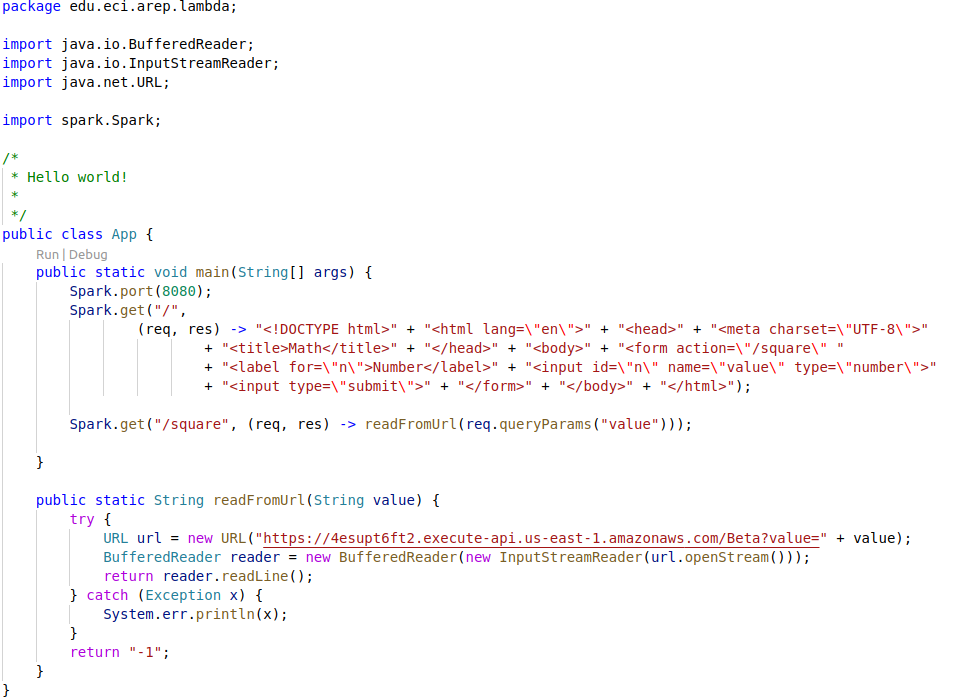
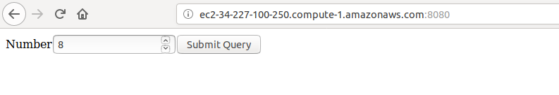
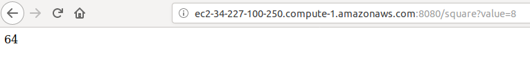

# Amazon Gateway y Lambda

En este laboratorio se creó un pequeño servicio en Amazon lambda que es consumido mediante una aplicación alojada en Amazaon EC2. El sericio retorna el cuadrado del número ingresado.

A continuación se muestra el código del aplicativo que consume el servicio y una prueba de su funcionamiento.

## Código

## Prueba

